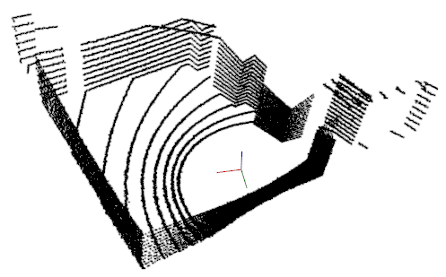
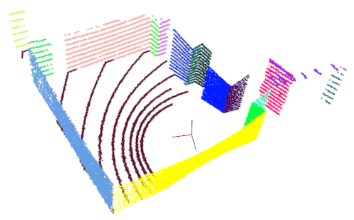
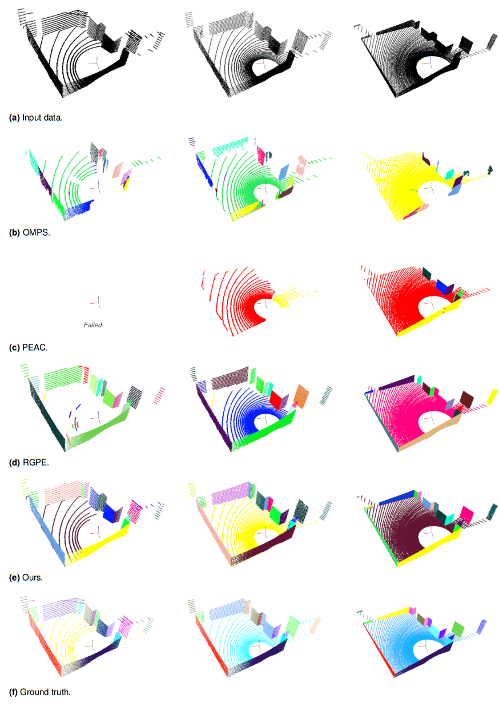
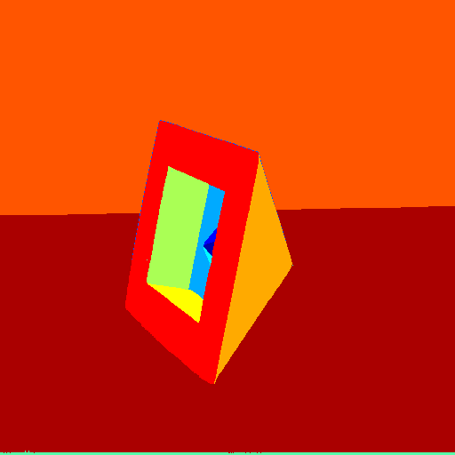
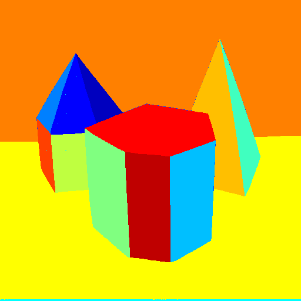
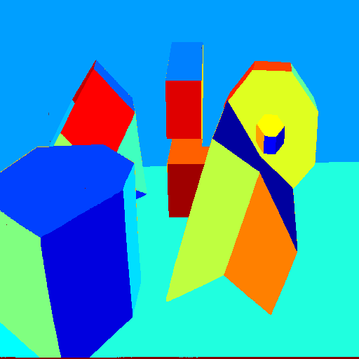
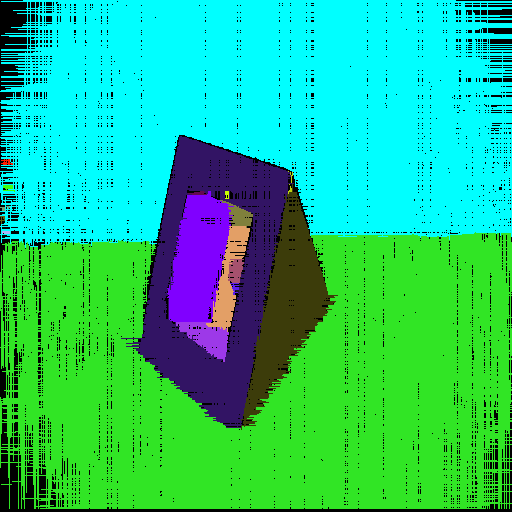
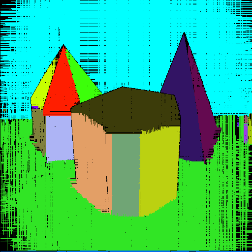
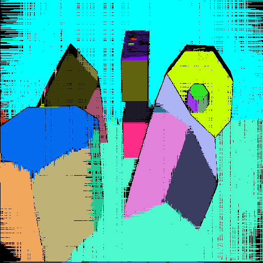

# CloudLine2Plane
This is a repo for multi-plane segmentation algorithm on sparse multi-line point cloud.

<p float="left">
  
       
</p>

​             Input point cloud (from VLP-16) 		Our multi-plane segmentation result

## Dependencies

* Eigen3
* PCL
* OpenCV
* YAML-CPP

## Build This Program

```
git clone https://github.com/bzdfzfer/CloudLine2Plane.git
mkdir -p ~/CloudLine2Plane/build/ && cd ~/CloudLine2Plane/build/
cmake .. 
make -j8
```

## Run This Program

```
Please refer bash files in the scripts folder.
e.g.

```


## Dataset Downloading

Currently, the sample data is located at the "data" folder.

* TODO (more datasets will be online by the net-disk like google-drive or one-drive. )

  

## Some Results

* Plane segmentation results of Velodyne Indoor Simulation dataset

  

  ​	              16-line Cloud   (VLP-16)                32-line Cloud (HDL-32)                   64-line Cloud (HDL-64) 

* Segmentation results on Perceptron Segcomp Dataset

  <p float="left">
    
    
    
    
    
       
      
    
        

  </p>

## Paper Citation:

* Xiaoguo D, Yuchu L, Qijun Chen, A fast multi-plane segmentation algorithm for sparse 3D LiDAR point clouds by line segment grouping, IEEE Transactions on Instrumentation and Measurement. (**Accepted**)

